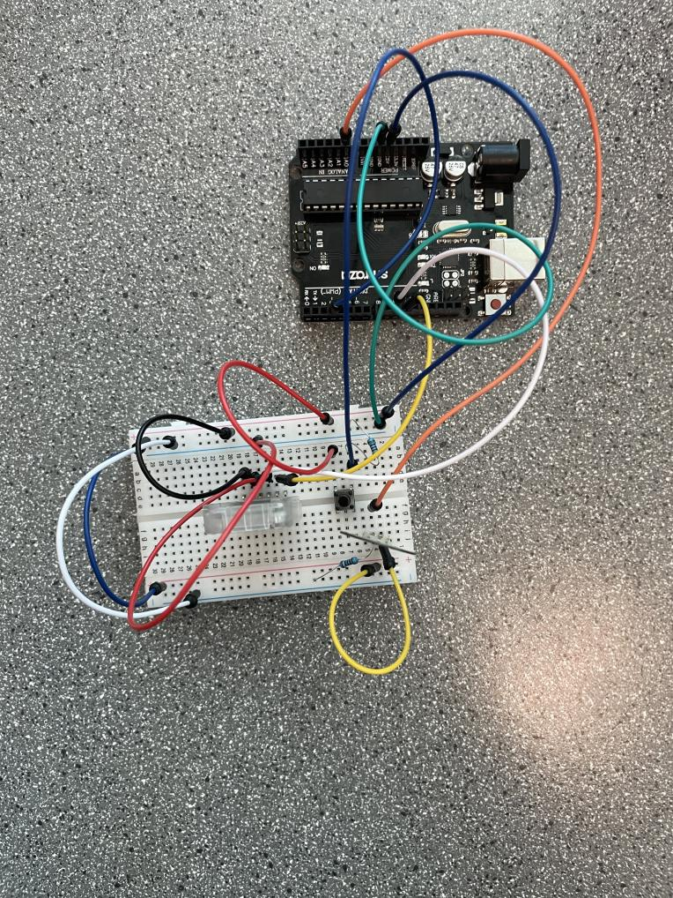

# Jet Ski Guard
[Jet Ski Guard](https://docs.google.com/presentation/d/1unlVfLe3UnMud6pbph6iTTxexlWXaeTwUBZnw_38jcU/edit#slide=id.p) is an alarm system for your jet ski.

## The Device

Install the alarm on your jet ski and place the master button in a hidden location. If someone sits on your jet ski without pressing the hidden button, a force sensor on the seat will activate and an alert will be sent to your phone.

## About
- Created by Lois and Manarap in the Summer 2023 HighTechU EngAcademy
- Winners of the Best Business Award

